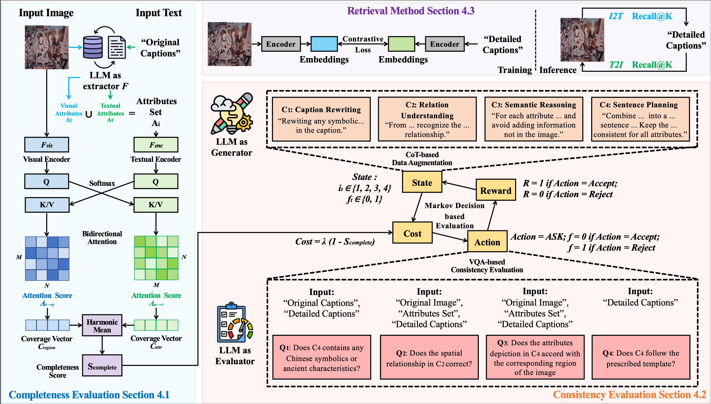

# C³: Completeness and Consistency for Cross-Modal Retrieval

**LLM-Driven Completeness and Consistency Evaluation for Cultural Heritage Data Augmentation in Cross-Modal Retrieval**

A Paper accepted at EMNLP 2025.

---

## 📖 Abstract

Cross-modal retrieval is essential for interpreting cultural heritage data, but its effectiveness is often limited by incomplete or inconsistent textual descriptions, caused by historical data loss and the high cost of expert annotation. While large language models (LLMs) offer a promising solution by enriching textual descriptions, their outputs frequently suffer from hallucinations or miss visually grounded details. To address these challenges, we propose $C^3$, a data augmentation framework that enhances cross-modal retrieval performance by improving the completeness and consistency of LLM-generated descriptions. $C^3$ introduces a completeness evaluation module to assess semantic coverage using both visual cues and language-model outputs. Furthermore, to mitigate factual inconsistencies, we formulate a Markov Decision Process to supervise Chain-of-Thought reasoning, guiding consistency verification through adaptive query control. Experiments on the cultural heritage datasets CulTi and TimeTravel, as well as on general benchmarks MSCOCO and Flickr30K, demonstrate that $C^3$ achieves state-of-the-art performance in both fine-tuned and zero-shot settings. 


---
## 📂 Related Resources

- [CulTi Dataset (GitHub)](https://github.com/yyyjjy/CulTi)

---
## 🛠️ Installation & Setup

1.  **Clone the repository:**
    ```bash
    git clone [https://github.com/your-username/C3-Cross-Modal-Retrieval.git](https://github.com/your-username/C3-Cross-Modal-Retrieval.git)
    cd C3-Cross-Modal-Retrieval
    ```


2.  **Install dependencies:**
    ```bash
    pip install -r requirements.txt
    ```


---
## 📜 Citation
If you use our work, please cite the following paper:

 ```bash

@inproceedings{zhang2025c3,
  title={LLM-Driven Completeness and Consistency Evaluation for Cultural Heritage Data Augmentation in Cross-Modal Retrieval},
  author={Jian Zhang, Junyi Guo, Junyi Yuan, Huanda Lu, Yanlin Zhou, Fangyu Wu, Qiufeng Wang, Dongming Lu},
  year={2025}
}

@inproceedings{yuan2025culti,
  title={Towards Cross-modal Retrieval in Chinese Cultural Heritage Documents: Dataset and Solution},
  author={Yuan, Junyi and Zhang, Jian and Wu, Fangyu and Lu, Huanda and Lu, Dongming and Wang, Qiufeng},
  booktitle={ICDAR},
  year={2023}
}

 ```

---
## 📞 Contact
For questions or collaborations, please open an issue or contact Jian Zhang.
